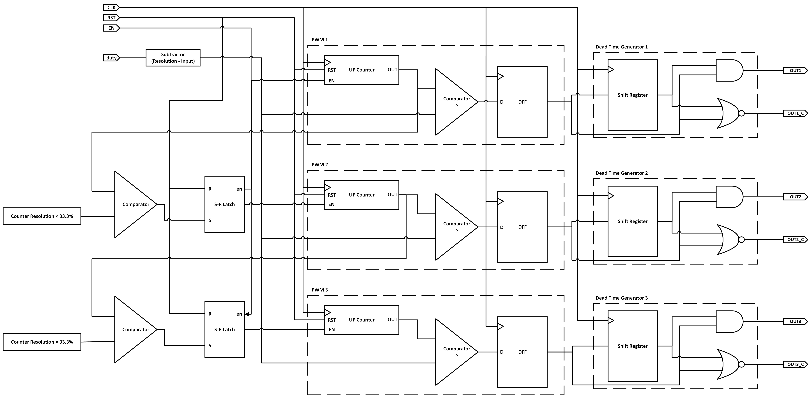
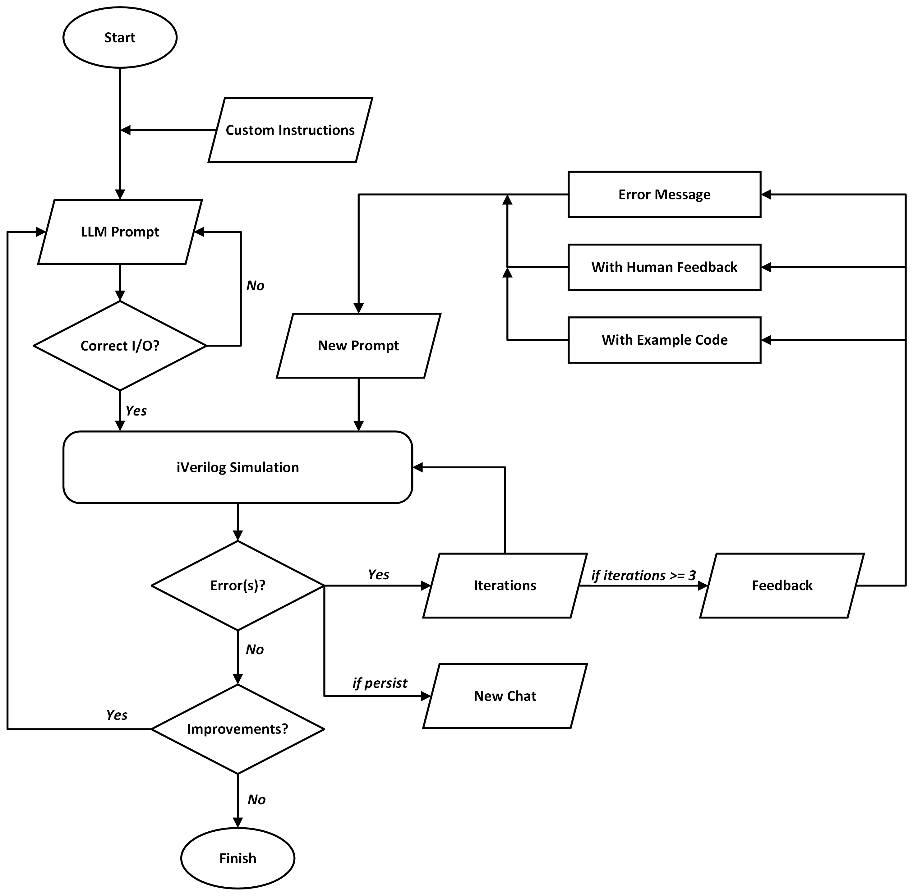
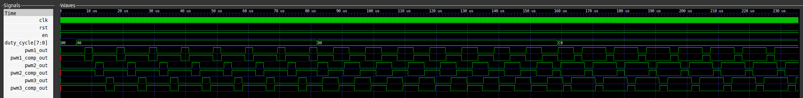
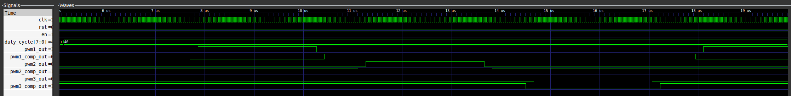

# Three-Phase Pulse Width Modulator (PWM) with Dead Time
Author: Emil Goh

## Background
Three-phase PWM is a crucial technique to enable efficient and precise control of electrical energy in various applications. It is fundamental in driving motors and managing power systems to facilitate a smooth conversion of electrical energy. A three-phase PWM is especially important to control brushless DC motors.

As the world's demand for automation through robots and drones and renewable energy systems such as solar inverters and wind turbines, increases rapidly, the integration of this technique in chips even more important. 

The design has also incorporated dead time which is essential in preventing short circuits, enhancing safety and reliability of the power electronic system.

## Objective
To develop a three-phase PWM with dead time that can be integrated as a peripheral in the Caravel harness to control electrical energy for various power electronic systems, using ChatGPT-4 to generate the RTL of the design.

## Circuit Design
The three-phase PWM circuit is designed to generate 3 PWM waveforms with its complementary signal (6 PWM waveforms altogether), each 120 degrees out of phase with the others. The duty cycle of the waveforms can also be adjusted by modifying the duty cycle input signal. Dead time is also introduced such that each of the PWM waveforms will not be toggled HIGH and LOW simultaneously, which could cause a short circuit. This ensures safe operation in applications when driving power electronics.    



The overall circuit of the three-phase PWM can be seen above.

The three-phase PWM design can be broken down into the following components:

1. **Controls**
    1. Signals
        1. Clock: Main clock signal to drive circuit
        2. Reset: To reset the circuit to the default state
        3. Enable: To activate and deactivate the circuit
    2. Duty Cycle Control
        1. Duty Cycle Input: Represents the desired PWM duty cycle
        2. Subtractor: Subtracts the input duty cycle with the counter resolution, inverting the input to the PWM comparators
2. **3 PWMs, each consisting of the following:**
    1. Up Counter: 8-bit counter (256 resolution), automatically resets to 0 after hitting 255 
    2. Comparator: Compares the counter value with the subtracted duty cycle value to produce the PWM waveform
    3. D Flip Flop (DFF): To filter out unwanted transitions 
    
3. **Phase Control (2 sets), each set consists of the following:**
    1. “One-third” Comparator: Compares the previous PWM’s counter output with 33.3% of the counter resolution. As such, the comparator will only produce a HIGH signal when the previous counter reaches 85/256.
    2. S-R Latch: Used to sustain the HIGH signal produced by the “one-third” comparator
    
    The signal from the S-R latch is connected to the ENABLE input of the PWM. This results in the counter of the following PWM being activated, only when the previous counter reaches 33.3% of its resolution and produces a second PWM waveform with a 120-degree phase difference. This logic is applied to the third PWM.
    
4. **3 Dead Time Generators, each consisting of the following:**
    1. Shift Register (4 DFF cascaded together): delays each PWM output by 4 clock cycles
    2. AND gate: Produces the main PWM output
    3. NOR gate: Produces the complementary PWM output
    
    The dead time generator output is produced by inputting the PWM waveform from each PWM module and the delayed PWM waveform. It introduces a short delay between the turn-on and off times of the PWM signals to prevent overlaps.

    More information on how the implemented Dead Time Generator works: [Dead Time Generator Operation](./docs/deadtimegenerator.md)

### Pin-out
| PWM           | Caravel  | GPIO    | Type   |
| ------------- | -------- | ------- | ------ |
| clk           | wb_clk_i |         | input  |
| rst           | wb_rst_i |         | input  |
| en            | io_in    | 23      | input  |
| duty_cycle    | io_in    | 24 - 31 | input  |
| pwm1_out      | io_out   | 32      | output |
| pwm1_comp_out | io_out   | 33      | output |
| pwm2_out      | io_out   | 34      | output |
| pwm2_comp_out | io_out   | 35      | output |
| pwm3_out      | io_out   | 36      | output |
| pwm3_comp_out | io_out   | 37      | output |

## LLM Conversational Flowchart
The conversational flow used is inspired by ChipChat and AI by AI.


The flowchart is designed such that the user will always be in the conversation loop until the design is satisfied. Apart from the error loop, there is also an improvement loop and thus, the user will only have to use one single GPT chat session to design their desired circuit.

However, it is recommended that each circuit is broken down into smaller components and developed in separate chats. From experience, it seems that ChatGPT does not remember every single bit of the conversation, and codes that are recalled might contain errors. By breaking the circuit into smaller parts, the conversation could be more manageable and less confusing for users.

In this case, two ChatGPT-4 chats were used. The first chat was used to design a single-phase PWM and the second was to improve and build on the existing single-phase PWM. Eventually, generating and developing a three-phase PWM with dead time. The links to the conversations can be found at the bottom of this section.

ChatGPT-4 with web browsing feature was used to design the three-phase PWM. This LLM was selected as it is known to be the best code generation model before fine-tuning. The web browsing feature was activated such that ChatGPT can search the web if it encounters unfamiliar prompts.

### Custom Instruction and Initial Prompt
Following ChipChat’s method of prompting ChatGPT, it is essential to tune ChatGPT such that it will respond to prompts as expected.

Here is an example from the Three-Phase PWM conversation, instructing ChatGPT to respond like an IC designer in Verilog:

>
> I want you to act as an IC designer, and implement the following in Verilog.
>
> I am attempting to design a three-phase pulse width modulator (PWM).
>

Apart from that, the specifications of the design prompted to ChatGPT should be as detailed as possible.

Here is an example from the Single PWM conversation, prompting ChatGPT to generate the RTL of a single PWM module:

> I am trying to create a Verilog model for a pulse width modulator (PWM).
The pulse width modulator should contain the following components and the respective specifications:
> 
> 1. Up Counter:
> - Input: Clock, Reset
> - 8 bits
> - Counter should automatically reset after reaching 255
> 2. Comparator:
> - Input: Duty Cycle of PWM, i.e. 128/256 for 50% duty cycle
> - Input: Output of Up Counter
> 3. D Flip Flop:
> - Input: Clock, Reset
> - Input: Output of Comparator
> - Output: PWM signal
> 
> The components should be separated into different modules and later combined into a single PWM module.
>

ChatGPT was able to generate an RTL with some errors. This brings us to the error feedback loop so that ChatGPT could fix the error encountered.

### Error Feedback Loop
A few feedbacks when faced with an error have been implemented. Firstly, the error message produced by the simulator is prompted to the GPT.

An example of the “error message” feedback from the Single PWM conversation would be as such:
>
> There is an error on line 14 in the implementation.
>

It could also be pasted directly into the prompt. Here is an example of another error message:
>
> this is the error message:  
> .v:50: error: reg count; cannot be driven by primitives or continuous assignment.  
> pwm.v:50: error: Output port expression must support continuous assignment.  
> pwm.v:50:      : Port 3 (count) of UpCounter is connected to count  
> 2 error(s) during elaboration.  
>

When the same error persists even after prompting the error message, the user could carry on with human feedback. An example from the Single PWM conversation will be:
>
> There is an extra semicolon at the end of the module.
>

The user could also prompt ChatGPT with a sample code. This is an example from the Three-Phase PWM conversation:If errors persist, the user can prompt the GPT with a sample code. This is an example from the Three-Phase PWM conversation:
> This is an example code of an SR latch. Can you code according to this structure and logic?

```verilog
module SR_latch(  
    input en, rst, S, R,  
    output reg Q  
);  
   
   always@(*) begin    
        if(rst) Q<= 1'b0;  
        else if(en) begin  
            case({S,R})  
                2'b00 : Q<= Q;  
                2'b01 : Q<= 1'b0;  
                2'b10 : Q<= 1'b1;  
                default : Q<=2'bxx;  
            endcase  
        end
    end  
endmodule  
```

By examining the logic and structure of the example code, ChatGPT would generate a code similar to the sample code, fitting it into the design.

Here is a sample of the generated code by ChatGPT to be fitted into the Three-Phase PWM design:
```verilog
module SRLatch(
    input wire en,
    input wire rst,
    input wire set,
    input wire reset,
    output reg q
);

    always @(*) begin
        if (rst)
            q <= 1'b0;
        else if (en) begin
            case ({set, reset})
                2'b00 : q <= q;  // Retain previous state
                2'b01 : q <= 1'b0;  // Reset
                2'b10 : q <= 1'b1;  // Set
                default: q <= 1'bx;  // Undefined state
            endcase
        end
    end

endmodule
```


### Improvement Loop
There has to be some form of improvement which ChatGPT could do after generating an RTL which has no errors and works as expected. It could also be a feature which was missed out in the previous prompt. Thus, having this improvement loop allows the user to repeat the generation of the RTL with desired improvements implemented without human intervention.

An improvement was made in the Single PWM conversation as the ENABLE signal was overlooked in the previous prompts.

>
> Can you add an 'enable' signal in the PWM module?
> 

ChatGPT was able to add the ENABLE signal to the existing code. The only downside to this is that the user has to simulate the generated code again to check for validity.

### Links
Below are the links to the conversations with ChatGPT-4:

Single-Phase PWM: https://chat.openai.com/share/ff55a56d-56fa-400e-878d-bc47a241caec

Three-Phase PWM: https://chat.openai.com/share/6900a303-3c33-4b63-9cd5-74ca69348593

## Simulation and Results
Simulation is done using iVerilog and viewed on GTKWave.

Below is the overview of the waveform as the duty cycle increases from 0% to 25%, 50%, and 75%.


As observed in the waveform below, when the duty cycle is set to 25%, there is a dead time of 4 clock cycles in between each transition.


The waveform changes when the duty cycle is adjusted.


The three-phase PWM with dead time is working as expected.

The VCD file can also be found here: [Output Waveform](./docs/output.vcd) .

## Conclusion
The design generates 3 PWM with 3 complement signals, with a dead time of 4 clock cycles.
It also passes the MPW precheck and tape-out processes on the Efabless platform with no error.

## Reflection and Acknowledgement
Despite coming from an electrical engineering background, this is the first time I went through the entire IC design RTL to GDS (and maybe to chip) flow. It has been a refreshing and exciting experience to be a small part of this movement to democratise IC design by submitting a simple design for the AI-generated Open-Source Silicon Design Challenge.

I would like to use this opportunity to thank my mentors, Dr Teo Tee Hui from the Singapore University of Technology and Design (SUTD), Dr Wey I-Chyn from Chang Gung University (CGU) in Taiwan, and Mr Xiang Mao Yang from SUTD for their unwavering support and guidance. Also, a big thank you to the Efabless team who has made all these possible.

[](https://opensource.org/licenses/Apache-2.0) [](https://github.com/efabless/caravel_project_example/actions/workflows/user_project_ci.yml) [](https://github.com/efabless/caravel_project_example/actions/workflows/caravel_build.yml)

| :exclamation: Important Note            |
|-----------------------------------------|

## Please fill in your project documentation in this README.md file 

Refer to [README](docs/source/index.rst#section-quickstart) for a quickstart of how to use caravel_user_project

Refer to [README](docs/source/index.rst) for this sample project documentation. 

Refer to the following [readthedocs](https://caravel-sim-infrastructure.readthedocs.io/en/latest/index.html) for how to add cocotb tests to your project. 
