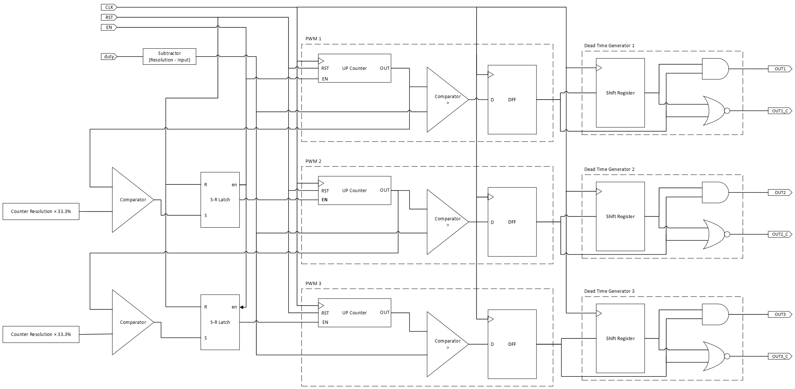
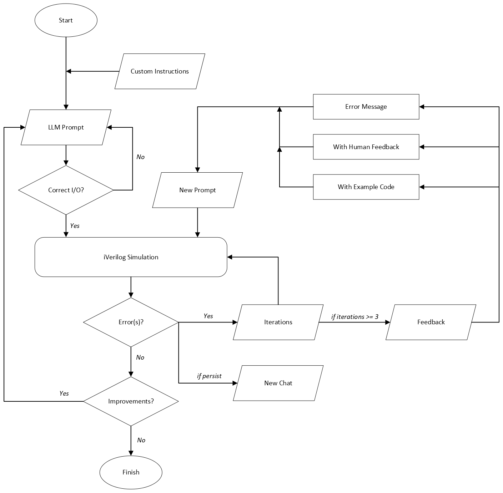

# Three Phase Pulse Width Modulator (PWM) with Dead Time
Author: Emil Goh

## Background
Three-phase PWM is a crucial technique to enable efficient and precise control of electrical energy in various applications and is fundamental in driving motors and managing power systems to facilitate a smooth conversion of electrical energy.

As the world's demand for automation through robots and drones, and renewable energy systems, such as solar inverters and wind turbines, increases rapidly, it has made the integration of this technique even more important.  

The design has also incorporated dead time which is essential in preventing short circuits, enhancing safety and reliability of the power electronic system.

## Objective
To develop a three-phase PWM with dead time that can be integrated as a peripheral in the Caravel harness to control electrical energy for various power electronic systems, using ChatGPT-4 to write the RTL of the design.

## Circuit Design
The three-phase PWM circuit is designed to generate 3 PWM waveforms with its complementary (6 PWM waveforms altogether), each 120 degrees out of phase with the others. The duty cycle of the waveforms can also be adjusted by modifying the duty cycle input signal. Dead time is also introduced such that each of the PWM waveforms will not be toggled HIGH and LOW at the same time, which could cause a short circuit. This ensures safe operation in applications such as driving motors or inverters.  

The overall circuit of the three-phase PWM can be seen above.

The three-phase PWM design can be broken down into the following components:

1. **Controls**
    1. Signals
        1. Clock: Main clock signal to drive circuit
        2. Reset: To reset the circuit to the default state
        3. Enable: To activate and deactivate the circuit
    2. Duty Cycle Control
        1. Duty Cycle Input: Represents the desired PWM duty cycle
        2. Subtractor: Subtracts the input duty cycle with the counter resolution, inverting the input to the PWM comparators
2. **3 PWMs, each consisting of the following:**
    1. Up Counter: 8-bit counter (256 resolution), automatically resets to 0 after hitting 255 
    2. Comparator: Compares the counter value with the subtracted duty cycle value to produce the PWM waveform
    3. D Flip Flop (DFF): To filter out unwanted transitions 
    
3. **Phase Control (2 sets), each set consists of the following:**
    1. “One-third” Comparator: Compares the previous PWM’s counter output with 33.3% of the counter resolution. As such, the comparator will only produce a HIGH signal when the previous counter reaches 85/256.
    2. S-R Latch: Used to sustain the HIGH signal produced by the “one-third” comparator
    
    The signal from the S-R latch is connected to the ENABLE input of the PWM. This results in the counter of the following PWM being activated, only when the previous counter reaches 33.3% of its resolution and produces a second PWM waveform with a 120-degree phase difference. This logic is applied to the third PWM.
    
4. **3 Dead TIme Generators, each consisting of the following:**
    1. Shift Register (4 DFF cascaded together): delays each PWM output by 4 clock cycles
    2. AND gate: Produces the main PWM output
    3. NOR gate: Produces the complementary PWM output
    
    The dead time generator output is produced by inputting the PWM waveform from each PWM module and the delayed PWM waveform. It introduces a short delay between the turn-on and off times of the PWM signals to prevent overlaps.

### Pin-out
| PWM           | Caravel  | GPIO    | Type   |
| ------------- | -------- | ------- | ------ |
| clk           | wb_clk_i |         | input  |
| rst           | wb_rst_i |         | input  |
| en            | io_in    | 23      | input  |
| duty_cycle    | io_in    | 24 - 31 | input  |
| pwm1_out      | io_out   | 32      | output |
| pwm1_comp_out | io_out   | 33      | output |
| pwm2_out      | io_out   | 34      | output |
| pwm2_comp_out | io_out   | 35      | output |
| pwm3_out      | io_out   | 36      | output |
| pwm3_comp_out | io_out   | 37      | output |

## LLM Conversational Flowchart
The conversational flow used is inspired by ChipChat and AI by AI.

The flowchart is designed such that the user will always be in the conversation loop until the design is satisfied. Apart from the error loop, there is also an improvement loop and thus, the user will only have to use one single GPT chat session to design their desired circuit.

In this case, two ChatGPT-4 chats were used for easier reference in the future. The first chat was used to design a single-phase PWM and the second was used to improve and build on the existing single-phase PWM to generate a three-phase PWM with dead time.

A few feedbacks when faced with an error have been implemented. Firstly, the error message produced by the simulator is prompted to the GPT.The flowchart is designed such that the user will always be in the conversation loop until the design is satisfied. Apart from the error loop, there is also an improvement loop and thus, the user will only have to use one single GPT chat session to design their desired circuit.

In the error loop, the LLM is 

ChatGPT-4 with web browsing feature was used to design the three-phase PWM. This LLM was selected as it is known to be the best code generation model before fine-tuning. The web browsing feature was activated such that ChatGPT can search the web if it encounters unfamiliar prompts.

An example of the “error message” feedback would be as such:
>
>this is the error message:  
>.v:50: error: reg count; cannot be driven by primitives or continuous assignment.  
>pwm.v:50: error: Output port expression must support continuous assignment.  
>pwm.v:50:      : Port 3 (count) of UpCounter is connected to count  
>2 error(s) during elaboration.  
>

When the same error persists even after prompting the error message, the user could carry on with human feedback. An example will be as such:
>
>There is an extra semicolon at the end of the module.
>

If errors persist, the user can prompt the GPT with a sample code. An example will be:
> This is an example code of an SR latch. Can you code according to this structure and logic?  
>>module SR_latch(  
>>input en, rst, S, R,  
>>output reg Q  
>>);  
>>   
>> always@(*) begin    
>> &nbsp;if(rst) Q<= 1'b0;  
>> &nbsp;else if(en) begin  
>> &nbsp;&nbsp;case({S,R})  
>> &nbsp;&nbsp;&nbsp;2'b00 : Q<= Q;  
>> &nbsp;&nbsp;&nbsp;2'b01 : Q<= 1'b0;  
>> &nbsp;&nbsp;&nbsp;2'b10 : Q<= 1'b1;  
>> &nbsp;&nbsp;&nbsp;default : Q<=2'bxx;  
>> &nbsp;&nbsp;endcase  
>> &nbsp;&nbsp;end  
>> &nbsp;end  
>>   
>> endmodule  
>>

ChatGPT-4 with web browsing feature was used to design the three-phase PWM. This LLM was selected as it is known to be the best code generation model before fine-tuning. The web browsing feature was activated such that ChatGPT can search the web if it encounters unfamiliar prompts.

Below is the link to the conversations:

Single-Phase PWM: https://chat.openai.com/share/ff55a56d-56fa-400e-878d-bc47a241caec

Three-Phase PWM: https://chat.openai.com/share/6900a303-3c33-4b63-9cd5-74ca69348593

## Simulation and Results
Simulation is done using iVerilog and viewed on GTKWave.

Below is the overview of the waveform as the duty cycle increases from 0% to 25%, 50%, and 75%.

As observed in the waveform below, when the duty cycle is set to 25%, there is a dead time of 4 clock cycles in between each transition.

The waveform changes when the duty cycle is adjusted.

The three-phase PWM with dead time is working as expected.

## Reflection and Acknowledgement
Despite coming from an electrical engineering background, this is the first time I went through the entire IC design RTL to GDS (and maybe to chip) flow. It has been a refreshing and exciting experience to be a small part of this movement to democratise IC design by submitting a simple design for the AI-generated Open-Source Silicon Design Challenge.

I would like to use this opportunity to thank my mentor, Dr Teo Tee Hui, and Mr Xiang Mao Yang from the Singapore University of Technology and Design for their unwavering support and guidance. Also, a big thank you to the Efabless team who has made all these possible.

  

| :exclamation: Important Note            |
|-----------------------------------------|

## Please fill in your project documentation in this README.md file 

Refer to [README](docs/source/index.rst#section-quickstart) for a quickstart of how to use caravel_user_project

Refer to [README](docs/source/index.rst) for this sample project documentation. 

Refer to the following [readthedocs](https://caravel-sim-infrastructure.readthedocs.io/en/latest/index.html) for how to add cocotb tests to your project. 