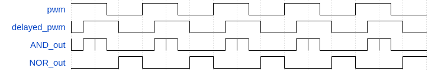

# Dead Time Generator Operation

As mentioned, the dead time generator used in the design consists of a shift register, an AND gate, and a NOR gate.

As seen in the above waveform, the shift register delays the generated PWM signal (pwm) by a certain  amount of time, resulting in a PWM signal with a phase difference (delayed_pwm). The two signals are then passed through the AND and NOR logic gates to produce two complementary PWM signals with dead time (AND_out and NOR_out). The dead time generated is equal to the time delayed by the shift register.

Disclaimer: The waveform above is drawn for easier explanation of the dead time generator’s operation, and not the actual waveform produced in the simulation by the design.